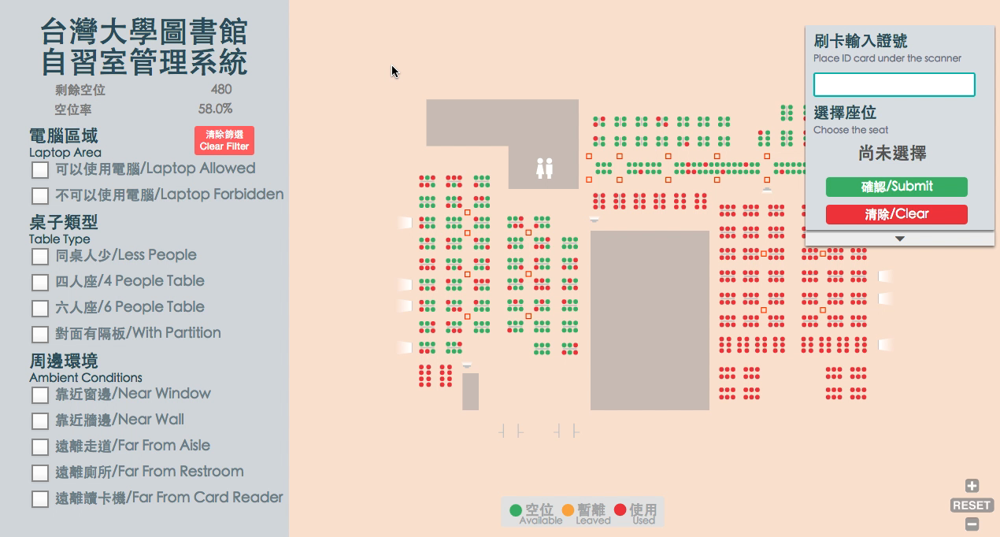

# NTU Library [](https://github.com/42Zavattas/generator-bangular)
An elegant redesign of library's seating system at NTU


## Early Experience Design
- define the problem
- interview 6 students
- organize transcripts
- AFFINITY DIAGRAM: find patterns in interview data and make assumptions
- design a questionnaire
- collect 758 valid questionnaires
- slides: [Discovering](https://www.slideshare.net/lkiral/hack-campus-study-area-experience-design-discover) ,[Feedback from Library's Administrative Department](https://www.slideshare.net/lkiral/hack-47826894)




#### [video demo](https://drive.google.com/file/d/1dCGB1riOJL8klBP1rlj4aongKxxBJuBi/view?usp=sharing)

## Quick Start
### Install
```
$ npm install
$ bower install
```

### Start Server
```
$ gulp # or: gulp serve
```

### Build
```
$ gulp build
```

## Build with
- Angular.js 1
- Express.js
- [svg-pan-zoom](https://github.com/ariutta/svg-pan-zoom)

## Dev Tools
- Bower
- Gulp
